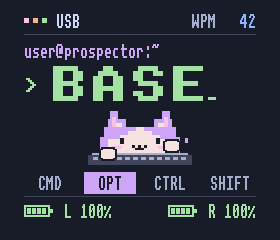

# Catppuccin terminal

Catppuccin Mocha terminal screen with a miniature typing cat inspired by the
Catppuccin mascot and Bongo Cat. This is a personal homage, not an official port.
Palette: [Catppuccin Mocha](https://github.com/catppuccin/catppuccin#-palette).



The built-in imagegen tool produced [the visual concept](concept.png) using
[this exact prompt](prompt.txt). The firmware adapts that concept into LVGL
labels and small rectangle draw commands. The generated PNG is a design
reference; firmware does not load it or allocate a full-screen image buffer.
Both native preview and firmware compile the same `catppuccin/view.c`.
The two bitmap fonts are shared with Vaporwave.

The cat alternates paws on emitted key presses while WPM is nonzero and rests
when WPM returns to zero. Updates may coalesce in ZMK's display queue, so this
is a typing activity indicator rather than a frame guaranteed for every key.
Active modifiers have a mauve fill; Caps Word uses peach and the label `CAPS`.
Zero, unknown (`--`), and disconnected (`OFF`) batteries remain distinct.

## Content contract

Keep the existing 280 × 240 landscape orientation, native offset (0,20),
RGB565 format, and 50% fixed brightness. Coordinates below are inclusive.

| Content | Envelope / policy |
| --- | --- |
| Header | x=24…255, y=12…29; `BT 256 --`, `WPM`, four digit cells |
| Terminal location | x=24…255, y=42…59 |
| Layer | x=48…255, y=61…105; `MOUSE` fits at 40 px advance |
| Custom layer names | Above 5 characters, use 8 px advance; above 26, use 23 + `...` |
| Cat and keyboard | x=88…191, y=111…164 |
| Modifiers | x=24…255, y=172…193; full `CMD`, `OPT`, `CTRL`, `SHIFT` / `CAPS` |
| Batteries and icons | x=24…255, y=202…219; `L 100%`, `R 100%` |

RGB565-quantized contrast against the base is 7.69:1 for subtext, 11.76:1
for text, 8.33:1 for mauve, 11.31:1 for green, 9.66:1 for peach and 8.27:1
for blue. Decorative separators use lower-contrast surface color.

## Build and validation

From `/Users/rick/personal/prospector-zmk-module`:

```sh
just preview
just firmware catppuccin
```

Validated on 2026-09-10:

- Both native layout suites pass. Catppuccin covers all seven configured layers,
  WPM 0/9/10/99/100/999 and back to zero, both batteries at 100%, 0/9/unknown/off,
  disconnected USB/Bluetooth, modifiers, Caps Word, custom names, both paw poses,
  restoration without stale pixels, and 1000 updates.
- Raw captures and the conservative 4 px inset / 40 px radius mask inspected.
  Gallery: `.preview/catppuccin/index.html`.
- Firmware selects `CONFIG_PROSPECTOR_STATUS_SCREEN_CATPPUCCIN=y` and
  `ZMK_EXTRA_MODULES=/Users/rick/personal/prospector-zmk-module`.
  FLASH: 415,032 / 806,912 bytes (51.43%).
  RAM: 174,546 / 262,144 bytes (66.58%).
  LVGL pool: 24,000 bytes; double partial buffers at 25% retained.
- UF2: `/Users/rick/personal/zmk-config/firmware/hillside_d50_dongle_catppuccin.uf2`.
  This target's CMake cache retains the local module override. The west manifest
  still pins `b8ef89cc00cf149891128b90fd06e9362ef91f6d`; this local theme is not
  present in that pin. No publication, pin change or flashing was performed.

Physical acceptance is pending. In the fitted case, check both 100% corners,
0→9→10→100→0 WPM, USB and disconnected Bluetooth, every layer, modifiers and
Caps Word, alternating paws during typing and rest after idle. Confirm text
legibility, palette, orientation and bezel clearance at normal viewing angle
and brightness. The stress mask is an estimate, not measured case geometry.
